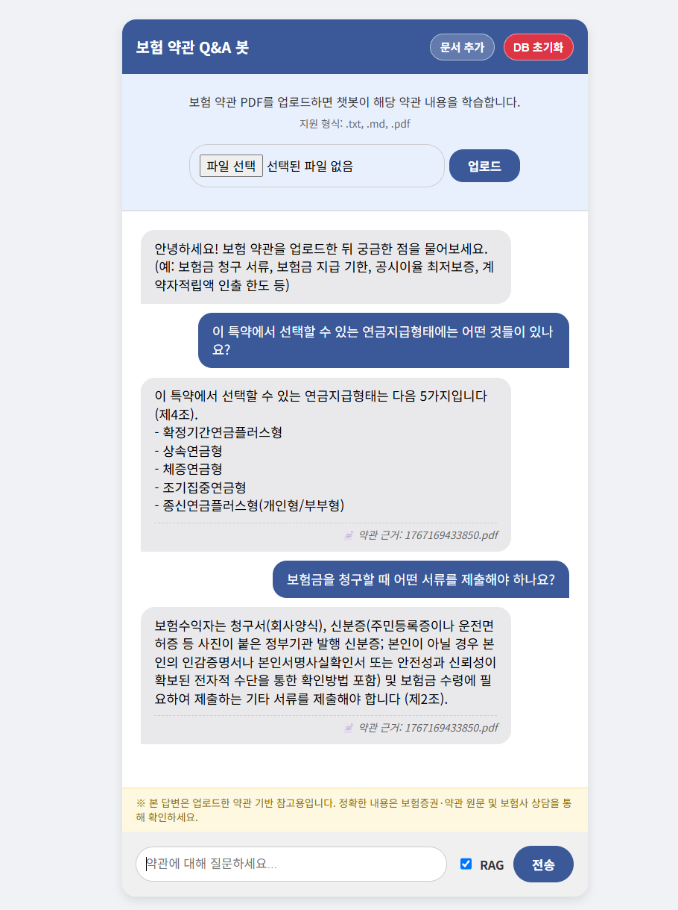
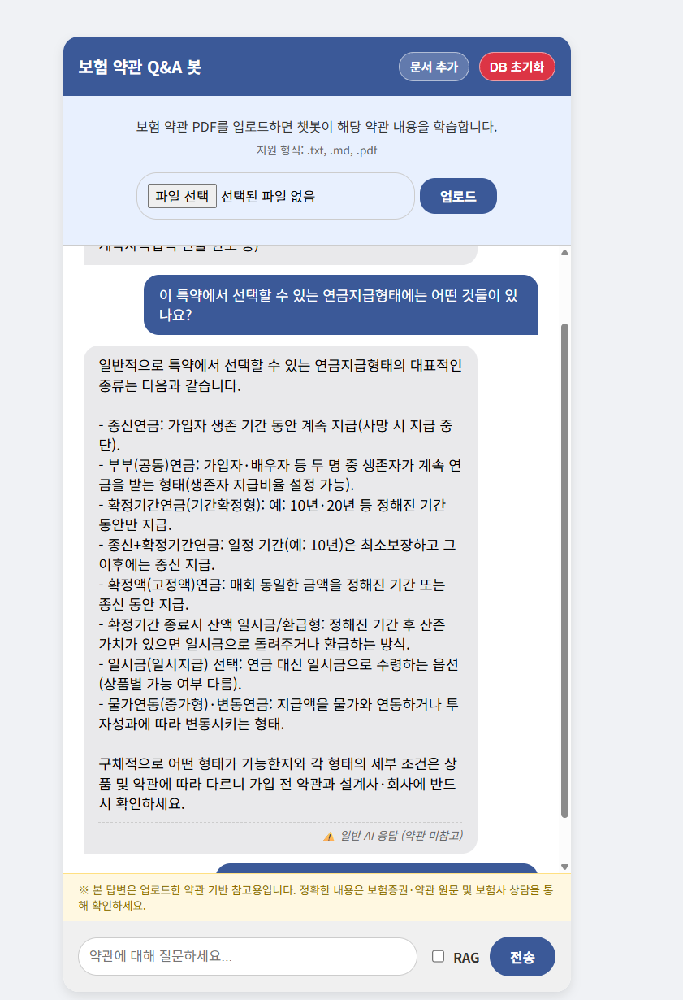
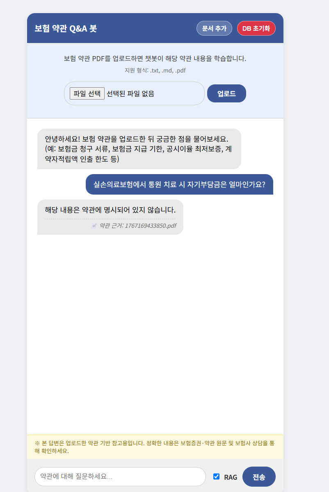
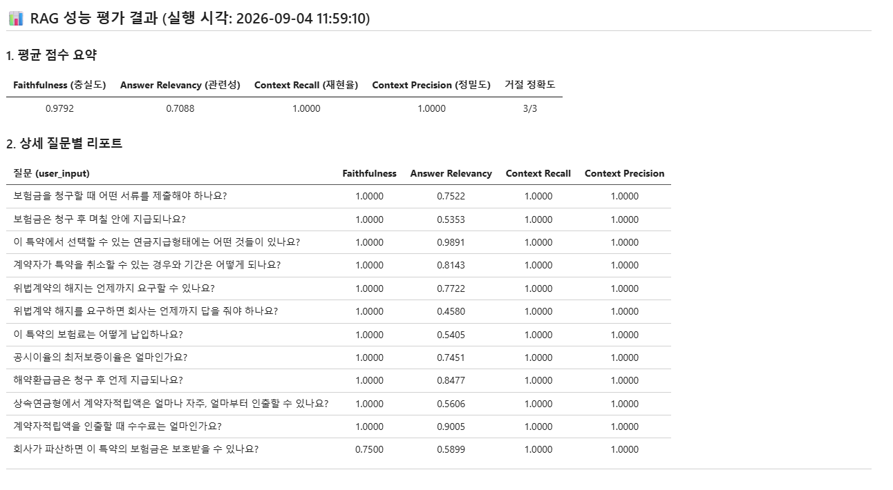

# 고찰 보고서 — 보험 약관 Q&A 봇 (RAG)

- 트랙/반: SSAFY JAVA 대전 4반
- 팀원: 이다빈, 정소현
- 주제: 보험 약관 Q&A 챗봇 (데모 문서: 삼성생명 플러스연금전환특약(무배당) 약관, 12쪽)
- 작성일: 2026-09-04

---

## 1. 생성형 AI API 호출 흐름에 대한 이해

### 1-1. 전체 요청 흐름

```
[브라우저] index.html / script.js
   │  fetch POST http://localhost:8000/chat  { message, use_rag }
   ▼
[FastAPI] main.py  /chat
   │  LangGraph 워크플로우 invoke(initial_state)
   ▼
 route_by_rag_flag (use_rag 분기)
   ├─ use_rag=false ───────────────────────────► generate_node (일반 프롬프트)
   └─ use_rag=true ─► retrieve_node ─► generate_node
         │ Chroma 유사도 검색 (k=5)            │ grounded=true  → RAG 프롬프트(조항 인용)
         │ 점수 ≥ 0.2 인 청크만 채택            │ grounded=false → "약관에서 찾지 못했습니다"
         │ 채택 0개면 grounded=false           │ use_rag=false  → 일반 프롬프트
         ▼                                    ▼
   OpenAI 호환 API (gms.ssafy.io) ← ChatOpenAI / OpenAIEmbeddings
         ▼
   { answer, grounded, source, disclaimer } → 브라우저 렌더링 (+ 문서참고 배지)
```

### 1-2. 핵심 이해

- **임베딩 호출**과 **채팅(생성) 호출**은 별개의 API 호출이다. 문서 업로드 시 임베딩 API가 청크마다, 질문 시(RAG면) 임베딩 1회 + 채팅 1회가 호출된다.
- LLM은 상태를 기억하지 않는다. 매 요청이 독립적이며 "맥락"은 프롬프트에 넣어준 `context` 문자열이 전부다.
- 프롬프트 = system(역할·규칙·참고 약관) + user(질문). "근거 없으면 '약관에 명시되어 있지 않습니다'라고 답하라" 같은 **행동 규칙도 프롬프트로 강제**한다.
- 답변에 붙이는 면책 문구를 LLM에게 시키면 매 답변에 들어가지만, **평가 시 "컨텍스트에 없는 문장"으로 감점**된다. → 면책은 API 응답의 `disclaimer` 필드 + 화면 고정 배너로 분리했다.

---

## 2. 문서 업로드 전 / 후 AI 응답의 차이

동일한 질문을 **RAG ON / OFF** 로 던져 답변을 비교했다.

### 2-1. RAG ON — 약관 근거 답변



- "연금지급형태" 질문 → 약관 제4조의 **5가지(확정기간·상속·체증·조기집중·종신연금플러스형)** 를 정확히 나열, 근거 `(제4조)` 표기
- "보험금 청구 서류" 질문 → 약관 제2조의 청구서·신분증·기타 서류를 그대로, 근거 `(제2조)` 표기
- 답변마다 하단에 **📄 약관 근거: (파일명)** 배지가 붙어 문서 참고 여부가 드러난다 (F206)

### 2-2. RAG OFF — 같은 질문, 일반 GPT 답변



- "연금지급형태" 질문 → 종신연금·부부연금·물가연동연금 등 **일반적인 연금 상식**을 길게 나열. 그럴듯하지만 **이 특약 약관에 실제로 있는 5가지와 다르다.**
- 하단 배지가 **⚠️ 일반 AI 응답 (약관 미참고)** 로 표시된다.

### 2-3. 약관 밖 질문 → 거절 (환각 방지)



- "실손의료보험 통원 자기부담금" 은 이 약관(연금전환특약)에 없는 내용 → **"해당 내용은 약관에 명시되어 있지 않습니다."** 로 거절한다.
- RAG OFF였다면 일반 GPT가 세대별 자기부담금 수치를 지어냈을 것이다(1차 평가 때 실제로 그랬음).

### 2-4. 결론

일반 GPT는 문장은 매끄럽지만 **이 약관과 무관한 내용을 사실처럼** 답한다. RAG는 조항 근거를 제시하고, 약관에 없는 질문은 지어내지 않고 거절한다. 즉 **답변의 정확성과 신뢰성은 "어떤 문서를 근거로 주었는가"에 직접 좌우된다.**

---

## 3. RAG 파이프라인 개선 과정과 지표 변화 (F207 / F208)

### 3-1. 고정 실험 조건

| 파라미터             | 값                                                      |
| -------------------- | ------------------------------------------------------- |
| CHUNK_SIZE / OVERLAP | 800 / 150 (약관 조항이 길어 넉넉하게)                   |
| RETRIEVE_K           | 5                                                       |
| RELEVANCE_THRESHOLD  | 0.2 (이 미만 청크는 근거에서 제외 → grounded=false)     |
| 임베딩 모델          | text-embedding-3-small                                  |
| 생성 모델            | gpt-5-mini                                              |
| 평가 셋              | 답변 가능 12문항(Ragas) + 약관 밖 질문 3문항(거절 점검) |

### 3-2. 3회 반복 개선과 Ragas 점수

| 회차 | 변경 내용                                                         | Faithfulness | Answer Relevancy | Context Recall | Context Precision |  거절   |
| ---- | ----------------------------------------------------------------- | :----------: | :--------------: | :------------: | :---------------: | :-----: |
| 1차  | 초기 (면책 문구를 답변에 강제 + 거절 케이스가 평가셋에 혼입)      |    0.6511    |      0.6021      |     0.9231     |      1.0000       |    —    |
| 2차  | 면책 문구를 답변 밖으로 분리 · 거절 케이스를 별도 지표로 분리     |    0.9167    |      0.4726      |     1.0000     |      1.0000       |   3/3   |
| 3차  | 프롬프트를 "완결된 서술형 한두 문장 + 조항은 문장 끝 괄호"로 조정 |  **0.9792**  |    **0.7088**    |   **1.0000**   |    **1.0000**     | **3/3** |

**3차(최종) 실행 결과** ([ragas_eval_history.md](ragas_eval_history.md) · [ragas_eval_results.csv](ragas_eval_results.csv)):



- Faithfulness는 12문항 중 11개가 1.0000, "회사 파산 시 보호" 1건만 0.75 (예금자보호법 관련 부연 1문장이 약관 컨텍스트 밖으로 판정됨)
- Answer Relevancy는 서술이 긴 질문(연금지급형태 0.99, 수수료 0.90, 해약환급금 0.85)은 높고, "언제까지/며칠 안에" 류 짧은 질문(0.46~0.54)은 낮음 — 답변 오류가 아니라 지표 특성
- Context Recall·Precision 전 문항 1.0000

### 3-3. 각 변경이 지표에 미친 영향 (해석)

1. **면책 문구 = Faithfulness의 최대 감점 요인이었다.**
   Ragas Faithfulness는 답변을 문장(claim) 단위로 쪼개 각 문장이 컨텍스트로 뒷받침되는지 본다.
   매 답변 끝의 "※ 정확한 내용은 보험사에 확인하세요"는 약관에 없는 문장이라 항상 감점됐다.
   답변이 ground_truth와 **글자까지 동일한데도 Faithfulness 0.50**인 케이스가 나왔다(감점분 = 면책 문장 1개).
   → 면책은 UX상 필요하므로 **API `disclaimer` 필드 + 화면 고정 배너**로 옮겼다. 1차→2차 Faithfulness 0.65→0.92.

2. **거절(refusal) 답변은 Ragas로 채점하면 구조적으로 0점이다.**
   "약관에 없습니다"는 컨텍스트로 뒷받침될 수 없고(Faithfulness 0), 답변에서 역질문을 만들 수 없다(Relevancy 0).
   평가셋에 섞여 있던 거절 케이스 1건이 12문항 평균을 통째로 끌어내렸다.
   → 거절은 **"거절 정확도 N/3"** 이라는 별도 지표로 분리(키워드 매칭). 현재 3/3.

3. **답변 문장 형태가 Answer Relevancy를 좌우한다.**
   Ragas Relevancy는 답변에서 LLM이 역으로 질문을 생성해 원 질문과의 임베딩 유사도를 잰다.
   2차에서 답변을 "…3영업일 이내 (제3조)."처럼 조각·기호 위주로 만들었더니 역질문 생성이 흔들려 0.60→0.47로 하락.
   3차에서 "완결된 한두 문장으로 서술, 조항은 문장 끝 괄호"로 바꾸자 0.47→0.71로 회복.
   그래도 "며칠 안에?", "언제까지?" 류 짧은 사실 질문은 Relevancy가 0.45~0.55에 머문다 — **지표의 한계이지 답변 오류가 아니다**(해당 답변들의 Faithfulness는 1.00).

4. **Context Recall/Precision은 처음부터 높았다 (0.92→1.00 / 1.00).**
   약관 12쪽 → 29청크로 작고, 질문이 특정 조항을 겨냥해 유사도 검색(k=5)이 잘 맞았다.
   청크가 더 크거나 문서가 방대해지면 Precision이 먼저 떨어질 것으로 예상된다.

### 3-4. RELEVANCE_THRESHOLD 관찰

- 약관 근거가 있는 질문의 상위 청크 점수: 0.24 ~ 0.41
- 약관 밖 질문(실손·암·자동차)의 최고 점수: 0.04 ~ 0.19
- → 0.2 경계로 grounded 판정이 깔끔하게 갈렸다. 다만 유효 질문이 0.19에 걸릴 위험이 있어, threshold를 통과하지 못해도 RAG 프롬프트 자체가 "컨텍스트에 없으면 거절"하도록 이중 안전장치를 뒀다.

---

## 4. RAG 방식의 장점과 한계

### 장점

- 재학습 없이 사유(私有)·최신 문서(약관)를 근거로 사용
- 답변에 조항 번호를 제시 → 사람이 원문 대조로 검증 가능, 환각 감소 (Faithfulness 0.98)
- "약관에 없음"을 명시적으로 답하도록 통제 가능 (거절 3/3)

### 한계

- 검색이 틀리면 생성도 틀린다 (garbage in, garbage out)
- 표·별표(예: 별표1 연금지급기준표)는 PDF→텍스트 변환에서 행/열 구조가 손실됨
- 청크 경계에서 문맥이 잘림 (OVERLAP으로 완화하나 완전하지 않음)
- 여러 조항을 종합해야 하는 멀티홉 질문에 약함
- 유사도 임계값은 문서·임베딩 모델마다 최적값이 달라 매번 튜닝 필요
- 자동 평가지표(Ragas)가 간결한 사실 답변·거절 답변을 과소평가함 → 지표를 절대적으로 신뢰하면 안 됨

---

## 5. 데이터(문서) 품질이 응답에 미치는 영향

- **텍스트 레이어가 있는 PDF**라 PyMuPDF로 추출이 잘 됐다(12쪽→29청크). 스캔 이미지 PDF였다면 OCR 없이는 검색 불가.
- 약관은 **정의 조항(용어 해설)** 이 잘 갖춰져 있어 "최저보증이율", "계약자적립액" 등 용어 기반 검색에 유리했다.
- 반대로 표 형태의 별표(별표1 연금지급기준표, 별표2 적립이율표)는 "연금종류 지급사유 지급금액"처럼 헤더와 값이 한 줄로 붙어 추출된다. 실제로 "종신연금플러스형 부부형의 종피보험자는 누구인가?" 같은 표 기반 질문은 조항 기반 질문보다 답변 근거가 흐릿했다.
- 문서가 도메인 밖 질문(실손·자동차)에는 애초에 근거가 없으므로, 데이터 범위 = 봇의 능력 범위임을 확인.

---

## 부록 A. 실행 방법

[README.md](../README.md) 참조.

## 부록 B. 평가 재현

```bash
cd servers
.venv/Scripts/python.exe eval_ragas.py
# 결과는 docs/ 에 저장됨: ragas_eval_results.csv, ragas_eval_history.md(누적)
```

- 답변 가능 질문: [servers/test_cases.json](../servers/test_cases.json) (12문항)
- 거절 점검: [servers/test_cases_refusal.json](../servers/test_cases_refusal.json) (3문항)
- 최신 결과: [ragas_eval_history.md](ragas_eval_history.md), [ragas_eval_results.csv](ragas_eval_results.csv)
